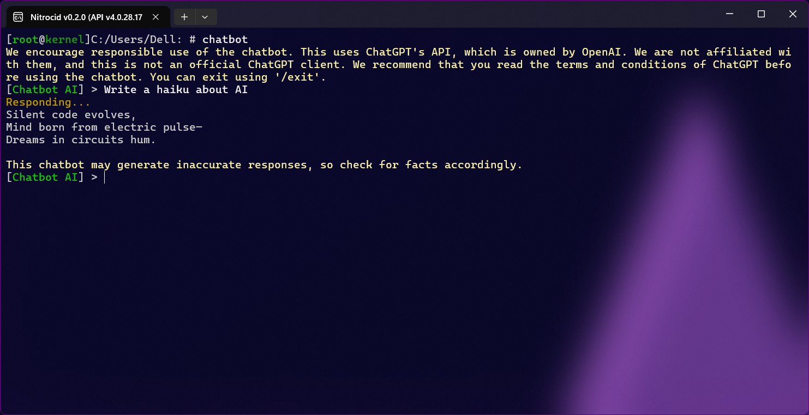

# 👋 Welcome!

<figure><figcaption></figcaption></figure>


🎊 🎊 🎊

**Recent Nightly builds of Nitrocid KS are now compatible with macOS. You can follow the instructions outlined in the Installing the Kernel > macOS page.**



This is the documentation for the second beta version of Nitrocid KS. There might be features that may not come to the final release. Use this beta version at your own discretion.


Thank you for installing Nitrocid KS on your system! This application is designed to simulate our future-planned kernel in managed code! Yes, our crafted kernel is made with our imagination and our art of kernel design!

This is not only a kernel simulator by itself which simulates hardware info fetching and booting, but it is also a bootable application. Wait! Are you trying to put it to your GRUB boot entry or your Windows BCD entry? Well, it's currently impossible to do! Because it's made in C#. Fortunately, we've made a bootloader simulator, GRILO, to simulate how GRUB boots into Linux by booting into any .NET application.

This kernel that is being simulated is planned for our future kernel made for personal and enterprise PCs and servers. It'll try to compete with existing monolithic kernels, such as Windows NT Kernel and Unix kernels.

## This documentation

To navigate the manual, select any page from the page list widget on the left of the screen.
