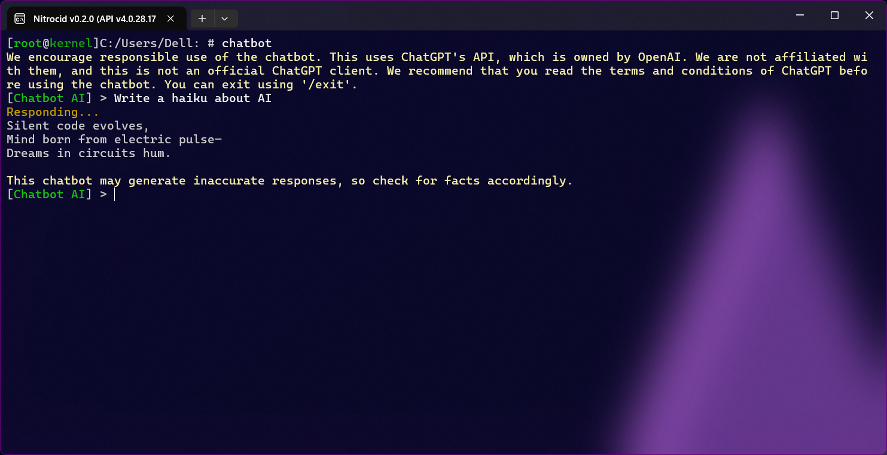

# 💦 Splash Internals

<figure><figcaption></figcaption></figure>

Splash screens are usually shown when the kernel reaches to the point that the pre-boot environment is no longer needed. Think of these splash screens as Plymouth splash screens that appear on Debian, or the Windows logo that appears when Windows starts. Nitrocid attempts to simulate the same concept.

The splash tools consists of the following classes:

* `SplashManager`: A class that handles splashes
* `SplashReport`: A class that handles reporting splashes

Splashes also contain a context to tell the splash screen that it's in a specific mode, which is one of the following:

* `Showcase`: This is used to showcase your splash screen and how well it works. Used by the `PreviewSplash()` functions for best experience.
* `StartingUp`: Used by the kernel to indicate that the kernel is starting up.
* `ShuttingDown`: Used by the kernel to indicate that the kernel is shutting down.

## Splash Management

The splash management class contains several useful tools to manage them, like loading custom splashes, unloading them, previewing them, etc. The three commonly used functions are:

### Loading the splashes


```csharp
public static void LoadSplashes()
```


This function loads all the splash files found in the custom splashes directory, `KSSplashes`. This will load the splash file, verify that it actually holds a single instance of a splash, and register it to the custom splash list.

### Unloading the splashes


```csharp
public static void UnloadSplashes()
```


This function does the reverse of `LoadSplashes()` by unloading all the splashes. This means that this function will unregister any splash found in the custom splashes list.

### Previewing the splashes

```csharp
public static void PreviewSplash(SplashContext context)
public static void PreviewSplash(bool SplashOut, SplashContext context)
public static void PreviewSplash(string splashName, SplashContext context)
public static void PreviewSplash(string splashName, bool splashOut, SplashContext context)
public static void PreviewSplash(ISplash splash, SplashContext context)
public static void PreviewSplash(ISplash splash, bool splashOut, SplashContext context)
```

These functions allow you to preview a specific splash screen either by previewing the current one, the specified splash name, or the specified splash base class instance that implements the ISplash instance. The SplashOut argument indicates whether to test out the `BeginSplashOut()` and `EndSplashOut()` functions.


Unless you know what you're doing, avoid using `OpenSplash()` and `CloseSplash()` to show progress. Instead, use one of the `PreviewSplash()` overloads if possible.


## Showing Messages during Kernel Boot

There are ways to show the messages during kernel boot when splashes are enabled.


In your mod start code, please use one of the following `ReportProgress()` functions to let the splash know that your mod is making progress. Don't call any of the console printing functions, since they don't log and may mess up the splash screen, depending on the splash.


### Reporting progress


```csharp
public static void ReportProgress(string Text, int Progress, params object[] Vars)
public static void ReportProgress(string Text, int Progress, bool force = false, ISplash splash = null, params object[] Vars)
```


The above functions let you report progress to the splash displayer when the kernel is booting. These messages are passed to the normal progress writer found in the current splash instance, which decides how to display it.

### Reporting warnings


```csharp
public static void ReportProgressWarning(string Text, params object[] Vars)
public static void ReportProgressWarning(string Text, Exception exception, params object[] Vars)
public static void ReportProgressWarning(string Text, bool force = false, ISplash splash = null, Exception exception = null, params object[] Vars)
```


The above functions let you report warnings to the splash displayer when the kernel is booting. These messages are passed to the warning progress writer found in the current splash instance, which decides how to display it.

### Reporting errors


```csharp
public static void ReportProgressError(string Text, params object[] Vars)
public static void ReportProgressError(string Text, Exception exception, params object[] Vars)
public static void ReportProgressError(string Text, bool force = false, ISplash splash = null, Exception exception = null, params object[] Vars)
```


The above functions let you report errors to the splash displayer when the kernel is booting. These messages are passed to the error progress writer found in the current splash instance, which decides how to display it.

### Important messages


```csharp
public static void BeginSplashOut(SplashContext context)
public static void EndSplashOut(SplashContext context)
```


If you want to show messages or anything interesting during the kernel boot, you may want to use both the `BeginSplashOut()` and `EndSplashOut()` functions, surrounding both with code to show a message inside. Here's a simple example to show a test message:


```csharp
SplashManager.BeginSplashOut(SplashContext.Showcase);
InfoBoxColor.WriteInfoBox(Translate.DoTranslation("We've reached {0}%!"), vars: prog);
SplashManager.EndSplashOut(SplashContext.Showcase);
```


### Boot log buffers

The kernel stores a short boot log buffer for each session. You can get the boot log by going to the administrative shell and executing the `bootlog` command.

You can also access the `LogBuffer` property in the `SplashReport` class, which is defined like this:


```csharp
public static string[] LogBuffer =>
    logBuffer.ToArray();
```

